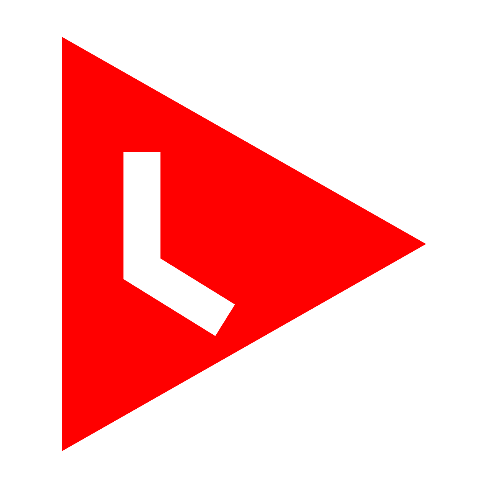
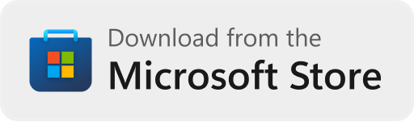

<h1 align="center">YouTube Watch Later</h1>

> Have you ever browsed YouTube and used that "Add to Watch Later" button? Me too.
> 
> Are you annoyed when you want to use that button, but it is not there? Me too!
> 
> Would you love to always have such a button, so you can instantly add videos to your Watch Later playlist? ME TOO!

YouTube Watch Later is a small extension that adds an "Add to Watch Later" button to videos on various pages and in the notification drawer. Simply install the extension, configure it to your likings inside the popup, and go add those videos to your Watch Later playlist!

## Installation

You can download the extension from the following stores:

|                                                     Chromium                                                      |                                                      Edge                                                       |                                                     Firefox                                                      |
| :---------------------------------------------------------------------------------------------------------------: | :-------------------------------------------------------------------------------------------------------------: | :--------------------------------------------------------------------------------------------------------------: |
|  Coming soon... |  Coming soon... |  Coming soon... |

Or, if you prefer to install the extension manually, you can download the latest release from [GitHub][GitHub latest].

## Settings
The following settings can be configured:

| Setting                    | Description                                                                                                                                                                           | Default  |
| -------------------------- | ------------------------------------------------------------------------------------------------------------------------------------------------------------------------------------- | -------- |
| Mark notifications as read | Allow notifications to be marked as read when you add those videos to your Watch Later playlist.                                                                                      | disabled |
| Logging                    | Allow the extension to send logs to your console. Could be useful for debugging purposes.                                                                                             | disabled |

## Changelog

Please see the [changelog] for more information about what has changed recently.

## License

The scripts and documentation in this project are released under the [GPL-3.0 license][license].

[Chrome]: https://chrome.google.com/webstore/detail/youtube-watch-later
[Edge]: https://microsoftedge.microsoft.com/addons/detail/youtube-watch-later
[Firefox]: https://addons.mozilla.org/en-US/firefox/addon/youtube-watch-later
[GitHub latest]: https://github.com/dnwjn/youtube-watch-later/releases/latest
[changelog]: CHANGELOG.md
[license]: LICENSE.md
