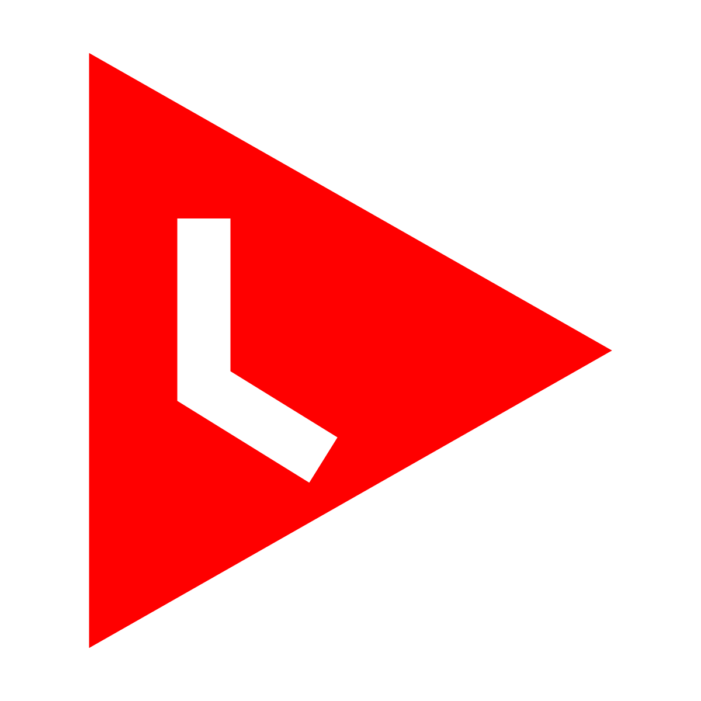
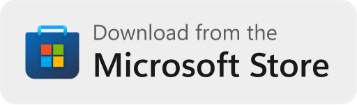

<h1 align="center">YouTube Watch Later</h1>

> Have you ever browsed YouTube and used that "Add to Watch Later" button? Me too.
>
> Are you annoyed when you want to use that button, but it is not there? Me too!
>
> Would you love to always have such a button, so you can instantly add videos to your Watch Later playlist? ME TOO!

YouTube Watch Later is a small extension that adds an "Add to Watch Later" button to videos on various pages and in the notification drawer. Simply install the extension, configure it to your likings inside the popup, and go add those videos to your Watch Later playlist!

## Installation

You can download the extension from the following stores:

|                                                                                        Chromium                                                                                        |                                                                                           Edge                                                                                            |                                                                          Firefox                                                                           |
|:--------------------------------------------------------------------------------------------------------------------------------------------------------------------------------------:|:-----------------------------------------------------------------------------------------------------------------------------------------------------------------------------------------:|:----------------------------------------------------------------------------------------------------------------------------------------------------------:|
|  |  |  |

Or, if you prefer to install the extension manually, you can download the latest release from [GitHub][GitHub latest].

## Locations

The button is available in the following locations:

| Location                                          | Description                                                                             | Since  |
|---------------------------------------------------|-----------------------------------------------------------------------------------------|--------|
| Video thumbnails                                  | Video thumbnails on the homepage, search results, channel pages, and other video lists. |        |
| Notification drawer                               | Video notifications in the notification drawer.                                         |        |
| Video player controls                             | Inside the video player controls, next to the like/dislike buttons.                     | v0.3.0 |
| Suggested video thumbnails (after video ends)     | Suggested video thumbnails at the end of a video.                                       | v0.4.0 |
| Suggested video thumbnails (next to/below player) | Suggested videos on the player page, next to the video (desktop) and below (mobile).    | v0.5.0 |

## Settings

### General

The following general settings can be configured:

| Setting                    | Description                                                                                      | Default  | Notes                                                   | Since  |
|----------------------------|--------------------------------------------------------------------------------------------------|----------|---------------------------------------------------------|--------|
| Mark notifications as read | Allow notifications to be marked as read when you add those videos to your Watch Later playlist. | disabled | Only affects the button inside the notification drawer. |        |
| Logging                    | Allow the extension to send logs to your console. Could be useful for debugging purposes.        | disabled |                                                         |        |
| Open What's New on update  | Automatically open a new tab with the latest changes after an update.                            | disabled |                                                         | v0.6.1 |

### Button

The following button settings can be configured:

| Setting    | Description                                                     | Default  |
|------------|-----------------------------------------------------------------|----------|
| Visibility | Set the visibility of the button to either `always` or `hover`. | `always` |
| Opacity    | Set the opacity of the button to either `full` or `half`.       | `full`   |

These settings do not affect the button inside the video player controls.

### Button position

The position of the button can be configured separately for each location it appears in:

| Location                  | Available positions                                    | Default     |
|---------------------------|--------------------------------------------------------|-------------|
| Grid videos               | `top left`, `top right`, `bottom left`, `bottom right` | `top left`  |
| Playlist videos           | `top left`, `top right`, `bottom left`, `bottom right` | `top left`  |
| Endscreen suggestions     | `top left`, `top right`, `bottom left`, `bottom right` | `top left`  |
| Player sidebar            | `top left`, `bottom left`                              | `top left`  |
| Notifications             | `top right`, `bottom right`                            | `top right` |
| Old endscreen suggestions | `top left`, `bottom left`                              | `top left`  |

## Changelog

Please see the [changelog] for more information about what has changed recently.

## License

The scripts and documentation in this project are released under the [GPL-3.0 license][license].

[Chrome]: https://chrome.google.com/webstore/detail/youtube-watch-later
[Edge]: https://microsoftedge.microsoft.com/addons/detail/youtube-watch-later
[Firefox]: https://addons.mozilla.org/en-US/firefox/addon/youtube-watch-later
[GitHub latest]: https://github.com/dnwjn/youtube-watch-later/releases/latest
[changelog]: CHANGELOG.md
[license]: LICENSE.md
